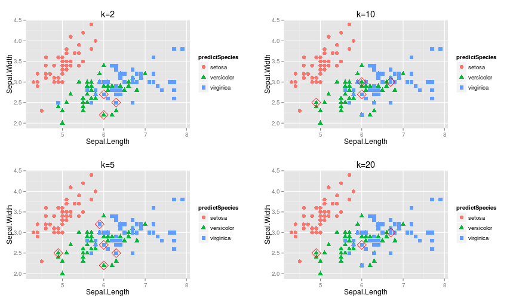

## Ideas of my app
### Problem


There is a classification algorithm named `KNN(k-Nearest Neighbor algorithm)`, which use one's 
neighbours to predict an unkown sample.

This algorithm is quite simple and useful, the only problem is use how many neighbours to predict?

--- 
## Ideas of my app
### Solution

Derictly, we can use a bunch of parameters to build a model, and choose the best one.

The best means the one has smallest misclassification rate.

--- 
## Ideas of my app
### Dataset
Here I use the famous data set `iris` in R, which has five variables.

```r
head(iris)
```

```
  Sepal.Length Sepal.Width Petal.Length Petal.Width Species
1          5.1         3.5          1.4         0.2  setosa
2          4.9         3.0          1.4         0.2  setosa
3          4.7         3.2          1.3         0.2  setosa
4          4.6         3.1          1.5         0.2  setosa
5          5.0         3.6          1.4         0.2  setosa
6          5.4         3.9          1.7         0.4  setosa
```

We will use the four predictors Sepal.Length, Sepal.Width, Petal.Length, Petal.Width to predict Species

--- 
## Ideas of my app
### Result





